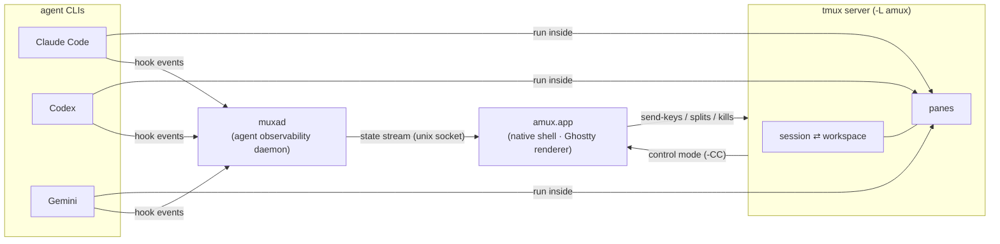

<p align="center">
  
</p>

<h1 align="center">amux</h1>
<p align="center"><strong>agent mux</strong> — the tmux-native, agent-first terminal for macOS</p>

<p align="center">
  
  
  
  
  
</p>

<p align="center">
  Your sessions live in <a href="https://github.com/tmux/tmux">tmux</a>, so they survive everything.<br/>
  Your agents are observed by <a href="https://github.com/Open330/muxa">muxa</a>, so you always know who needs you.<br/>
  Your terminal is native, so none of it feels like a compromise.
</p>

---

## Why amux

Every AI-coding session today is a pile of terminals: agents waiting on input you can't see,
sessions that die with the app, and a multiplexer UI from 2007. amux collapses that pile:

| | |
|---|---|
| 🪟 **Workspace = tmux session** | Every workspace is a real tmux session on a dedicated server (`tmux -L amux`). Close the app, reopen it — everything is exactly where you left it. |
| 🔍 **Agents are first-class** | muxa correlates Claude Code / Codex / Gemini CLI hook events with tmux panes. Workspaces show live badges: *2 working · 1 waiting · 1 error*. |
| 🖥 **Native, not rendered-in-tmux** | tmux control mode (`-CC`) projects windows and panes into native <a href="https://github.com/ghostty-org/ghostty">Ghostty</a> surfaces. No status bar, no copy-mode, no double UI. |
| 🔄 **CLI and GUI see the same world** | `tmux -L amux attach` from any terminal, or drive the app over its unix socket. Splits made in either place appear in both. |
| 📎 **Headless prompts** | Send text to a workspace over the socket; it lands in the session's active pane — no attach, no focus steal. |

## How it fits together



- **tmux** owns session existence, pane topology, scrollback, and persistence.
- **muxa (muxad)** owns agent state (`working / waiting_input / waiting_choice / error`), prompt history, and activity analytics.
- **amux.app** owns rendering, focus, notifications, and UX — a projection of the two sources of truth above, plus everything a native app should be.

## Build from source

Requirements: **macOS 14+**, **Xcode 26+**, `zig` (for GhosttyKit), `tmux 3.x`.
Optional: [muxa](https://github.com/Open330/muxa) (`muxad` running) for agent badges.

```bash
git clone --recurse-submodules git@github.com:Open330/amux.git
cd amux
./scripts/setup.sh                     # init submodules, build GhosttyKit, install hooks

# Debug build + launch (tagged: isolated socket/bundle id per tag)
CMUX_SKIP_ZIG_BUILD=1 ./scripts/reload.sh --tag dev --launch
```

Notes:

- `CMUX_SKIP_ZIG_BUILD=1` skips the Ghostty CLI helper, which pins zig 0.15.2 (GhosttyKit itself builds fine with newer zig). The helper isn't needed for the terminal.
- If `xcodebuild` complains about Command Line Tools, either `sudo xcode-select -s /Applications/Xcode.app/Contents/Developer` once, or prefix builds with `DEVELOPER_DIR=/Applications/Xcode.app/Contents/Developer`.
- Everything amux-owned runs against the dedicated `-L amux` tmux server with `-f /dev/null` isolation — your `~/.tmux.conf`, plugins, and default server are never touched.

### Try the integration in 60 seconds

```bash
# build & launch as above, then:
CMUX_TAG=dev scripts/cmux-debug-cli.sh rpc remote.tmux.mirror '{"local":true}'    # mirror local sessions
tmux -L amux -f /dev/null new-session -d -s demo                                  # or create one externally
CMUX_TAG=dev scripts/cmux-debug-cli.sh rpc remote.tmux.sessions '{"local":true}'  # discover them
```

Quit the app, run `tmux -L amux ls` — your sessions are still there. Reopen the app — they're workspaces again.

## Status & roadmap

Detailed plans live in [`.context/plans/R01-fable.md`](.context/plans/R01-fable.md) (architecture) and
[`.context/plans/R02-fable.md`](.context/plans/R02-fable.md) (productization).

| Phase | Scope | Status |
|---|---|---|
| **0 — Feasibility** | Local `tmux -CC` engine on the SSH mirror stack, pty spawn, config isolation, flood/OSC/scrollback gates | ✅ all gates passed |
| **1 — tmux-backed workspaces** | Local one-shot transport, `{"local":true}` socket RPC family, multipane socket I/O routing, launch-time session reconcile | ✅ live-verified |
| **2 — Agent layer** | `CmuxMuxa` daemon client (hello/snapshot/subscribe), sidebar agent badges, **attend** (jump to longest-blocked agent, ⌘⇧J), prompt composer, `waiting_choice` native sheet | ✅ shipped |
| **muxa co-evolution** | muxad carries `tmux_socket` + `tmux_session` on the wire so amux joins by session name across servers ([Open330/muxa#60](https://github.com/Open330/muxa/pull/60)) | ✅ merged (upgrade muxad) |
| **3 — Deep UX** | New/attach/detach/kill lifecycle, detach-by-default, opt-in ⌘N tmux-backed workspace | 🔶 lifecycle shipped — Detached-sessions **visual** sidebar section + stats panel remain |
| **4 — Product** | amux branding, bundled tmux 3.7b + muxad/muxa, opt-in muxad LaunchAgent, first-run wizard, signed + notarized dmg, Homebrew cask | ✅ **v0.1.0-alpha shipped** (Sparkle auto-update pending amux's own key) |

Download the signed, notarized build from [Releases](https://github.com/Open330/amux/releases/latest).

## Relationship to cmux

amux is a friendly fork of [cmux](https://github.com/manaflow-ai/cmux) by Manaflow — a Ghostty-based macOS
terminal with vertical tabs and agent notifications (original README preserved at
[`docs/upstream-cmux-README.md`](docs/upstream-cmux-README.md)). amux inherits its rendering stack,
workspace UI, and socket control plane — and crucially its SSH `tmux -CC` mirror, which amux generalized
into the local engine. Upstream is merged periodically.

| Component | License |
|---|---|
| amux (this repo, cmux fork) | **GPL-3.0-or-later** (see [LICENSE](LICENSE)) |
| [Ghostty](https://github.com/ghostty-org/ghostty) — renderer | MIT |
| [muxa](https://github.com/Open330/muxa) — agent observability | MIT OR Apache-2.0 |
| tmux | ISC |

## Development

- CI runs on a Gitea mirror (GitHub Actions workflows are intentionally removed).
- Contributor rules, typing-latency pitfalls, and package architecture live in [`CLAUDE.md`](CLAUDE.md) and `skills/`.
- The muxad client package has its own suite: `cd Packages/macOS/CmuxMuxa && swift test`.
- The original cmux README (incl. its translations) is preserved at [`docs/upstream-cmux-README.md`](docs/upstream-cmux-README.md); amux ships its own English README and will add translations as the docs mature.
